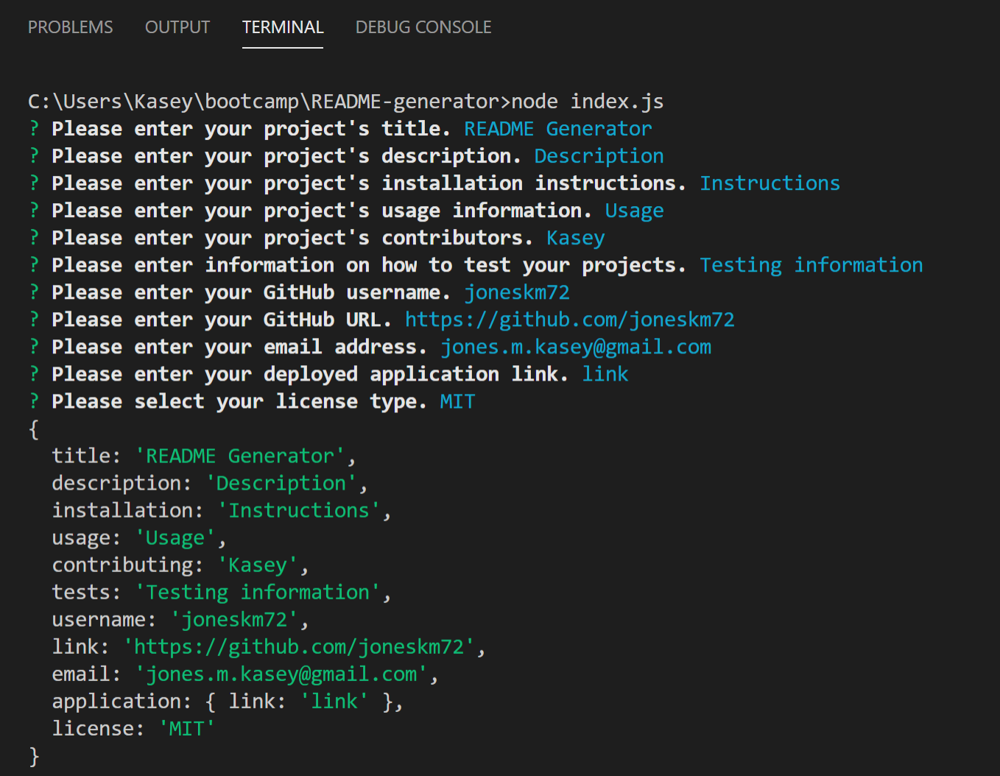
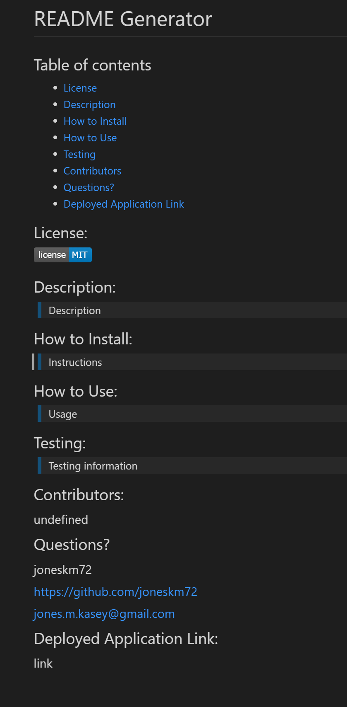

# README Generator

## Table of contents
  * [License](#license)
  * [Description](#description)
  * [How to Install](#installation)
  * [How to Use](#usage)
  * [Testing](#testing)
  * [Contributors](#contributors)
  * [Questions?](#questions)
  * [Deployed Application Link](#application-link)
  * [Images](#images)

## License:

## Description:

>A command-line application that dynamically generates a professional README.md from a user's input using the Inquirer package. The application is invoked using the command: node index.js. Uses Javascript and Inquirer.

## How to Install:

>* Navigate to https://github.com/joneskm72/README-generator
>* Select the green Code dropdown box
>* Copy the URL using either HTTPS or SSH

## How to Use:
> In the command-line application, perform the following steps:
  >* Type node index.js and press enter
  >* Fill out each prompt as it appears, pressing enter after completing each
  >* Select a license using the arrow keys and press enter

## Testing:

> Tested using the Integrated Terminal Visual Studio

> [Demo](https://drive.google.com/file/d/1Clsvr-hBg1KZBKFU7Zg_OsUc-tPTy2GN/view?usp=sharing)

## Contributors:

Kasey Jones

## Questions?

GitHub Username: joneskm72

GitHub Link: https://github.com/joneskm72

Email: jones.m.kasey@gmail.com

## Deployed Application Link:

https://github.com/joneskm72/README-generator

## Images

